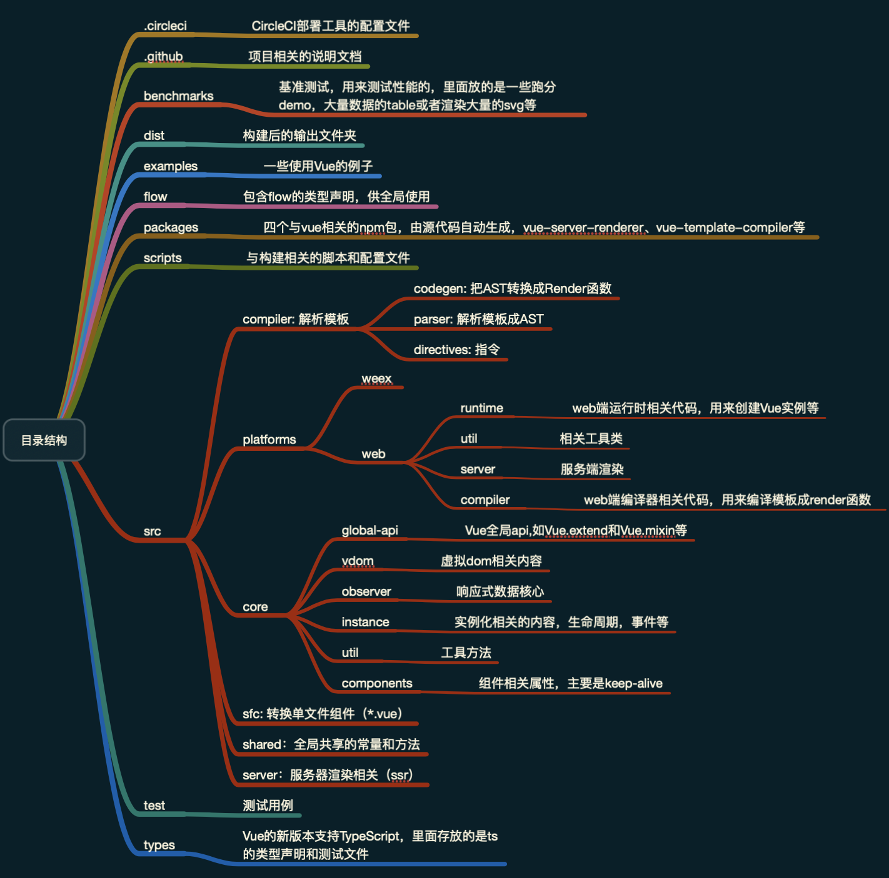

# 准备工作

## 确定版本
这个版本有两个意思，一个是具体的版本号，Aaron看的是`2.6.10`。另外一个是指vue打包后的功能版本，主要是`Runtime Only`和`Runtime + compiler`，区别就是前面一个需要编译工具去做预编译，它只保留了运行时的核心功能，后面一个则可以在客户端直接编译模板，Aaron看的是`Runtime + compiler`版本。

## 源码的目录结构
fork项目下来之后，我们可以看到目录结构如下：

[目录结构.zip](./目录结构.zip)

阅读源码的时候我们只要关注`src` 目录里面的代码就可以了，同时`flow` 文件夹里面有对应的类型声明，一般不会去主动翻，在IDE里面装上对应的插件之后，它能够自动帮我们做类型校验，以及鼠标移动到声明过的对象上的时候还能进行智能提示，对我们阅读代码也有帮助。

🤔这里有个疑问：为啥flow和ts会同时存在？
- 我快速浏览了一下，发现`flow`里有的声明，`.d.ts`里面好像也有对应的声明
- test命令里面同时执行`flow check` 和  `tsc` ，但是`tsc`只对`types` 里面的`.ts`文件做测试
- 项目里面除了`types` 和`packages` 有部分.ts 文件，其他都是.js 文件，虽然ts也可以对js文件做校验，但是已经有了`flow`不至于这么骚的操作吧

最后才发现，原来`types` 是官方的类型声明文件，一同放在这里维护的，跟Vue源码开发没啥关系，当你想在Vue项目里集成ts的时候，拉下来的声明文件就是这份🤦‍，所以`types` 文件夹在我们阅读源码的时候也是忽略的

## 怎么去看
我们从`package.json`里面的`dev`命令入手，它的构建目标是`web-full-dev`，也就是`Runtime + compiler`的实时编译模式，它可以监控并实时编译出`dist/vue.js`。我们只需要在`example`里面新建一个demo网页，并引用`dist/vue.js`，这样子我们可以边修改Vue的源码边打断点进行调试了。
