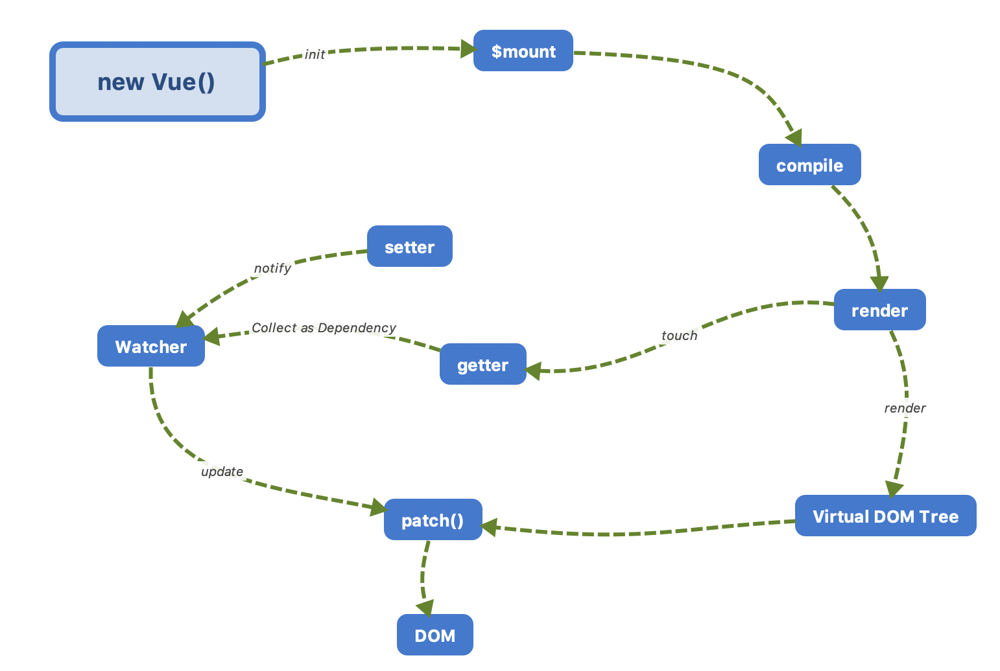

# 理解主线
本章的目的是抛弃细节，把主线理清，我们从new一个Vue对象开始，一路断点下去看看Vue做了什么。

## 新建demo
首先运行`npm run dev`，然后在`example`文件夹下新建`demo\index.html`，在里面我们写一个最简单的demo，并引用实时构建出来的`dist/vue.js`，然后在浏览器打开这份demo文件，通过调试可以一步一步地去查看Vue在初始化的时候经过了哪些步骤，把主线理清。
```html
<!DOCTYPE html>
<html lang="en">
<head>
  <meta charset="UTF-8">
  <script src="../../dist/vue.js"></script>
</head>
<body>
  <div id="app">
    {{ num }}
  </div>
  <script>
    debugger;
    new Vue({
      el: '#app',
      data() {
        return {
          num: 1
        }
      }
    })
  </script>
</body>
</html>
```

## Vue的运行过程
我们知道Vue的核心流程是**init -> mount -> render -> update -> patch -> dom**，Aaron通过上面demo设置断点地把这个流程浅浅地过了一下，但是在`new Watcher`那里因为Aaron本身对依赖收集的这块的掌握得不好，所以在大脑中只是大概有一个轮廓。这也正好是Aaron这次要去解读Vue的原因，希望在这个过程中把这些没弄懂的核心的原理一一弄懂。

Aaron在社区里面发现一个运行流程图，前期暂时把它作为借鉴👇



