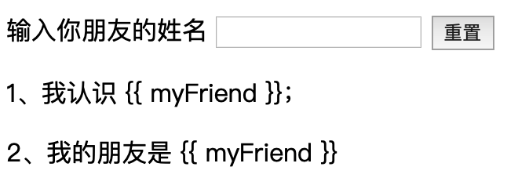

# 最小mvvm
我们先捋一下如果要实现一个最简单的变量和视图间的双向绑定的话需要考虑哪些东西。从一个简单的例子开始，有一个变量叫做`myFriend`，通过输入框可以改变它的值，重置按钮可以让它重置为空，然后页面上有两个p标签都引到了这个变量，可以把变量渲染出来，HTML代码如下👇，下面我们来一步步把这个`Mvvm`对象给实现了



```html
<!DOCTYPE html>
<html lang="en">
<head>
    <meta charset="UTF-8">
    <title>mvvm</title>
</head>
<body>
    <div id="app">
        <label for="name">输入你朋友的姓名</label>
        <input name="myFriend" v-model="myFriend" />
        <button @click="reset">重置</button>
        <p>1、我认识 {{ myFriend }}；</p>
        <p>2、我的朋友是 {{ myFriend }}</p>
    </div>

    <script>
        var vm = new Mvvm({
            el: '#app',
            data: {
                myFriend: '小明'
            },
            methods: {
                reset() {
                    this.myFriend = ''
                }
            }
        });
    </script>
</body>
</html>
```


## 首先我们先要拦截到数据变化
在前置知识里我们知道可以通过`Object.defineProperty`来给变量设置`getter`和`setter`，我们这里用一个函数封装一下👇

```js
function defineReactive (data, key, val) {
    Object.defineProperty(data, key, {
        enumerable: true,
        configurable: true,
        get: function () {
            // 待处理
            return value;
        },
        set: function (newVal) {
            if(value === newVal) return
            // 待处理
            value = newVal
        }
    })
}
defineReactive(this.data, 'myFriend', '小明')
```

## 由视图触发数据变更
其实就是通过页面上绑定的事件来变更数据，比如input输入、按钮点击回调、scroll回调等。我们暂时不去实现指令，留待后面去实现，这里我们先忽略`@click`和`v-model`，先直接去监听input事件和click事件，然后变更数据

```js
document.getElementById('input').addEventListener('input', e => this.myFriend = e.target.value);
document.getElementById('button').addEventListener('click', e => this.myFriend = '');
```

## 由数据变更触发视图更新
数据变更之后，我们要让视图上引用了这些数据的地方重新渲染。在这个例子上，页面里只有两个p标签使用了`myFriend`这个变量，如果有更多的地方使用到这个变量呢？我们需要把所有使用到这个变量的地方都同时更新。所以这里我们要拆分成两个步骤，第一步是把页面上引用到该变量的地方都收集起来，这个叫做收集依赖，我们在getter中收集依赖，然后等到数据变化的时候，也就是在setter中再把这些收集到的依赖循环触发一次，让页面更新。就像下面这样👇

```js
function defineReactive (data, key, val) {
    let dep = []; // 依赖列表
    Object.defineProperty(data, key, {
        enumerable: true,
        configurable: true,
        get: function () {
            dep.push(/* 引用了该变量的页面节点 */);
            return value;
        },
        set: function (newVal) {
            if(value === newVal) return
            value = newVal
            dep.forEach(node => /* 遍历依赖中的元素节点然后渲染 */)
        }
    })
}
defineReactive(this.data, 'myFriend', '小明')
```

## 实现mvvm类
理解上面需要的核心功能之后，我们就可以去思考如何实现`mvvm`这个类了，我们现在需要它实现下面这几个基础功能
- 挂载在`#app`下，直白说就是要把`#app`下所有的大括号插值变量做关联
- 把`data`代理到自身，比如我们在vue中更常用的是通过`this.myFriend`而不是通过`this.data.myFriend`去获取变量
- 获取指令并和变量做关联
- 实现变量的依赖收集和依赖更新

简单版实现如下👇

```js
class Mvvm {
    constructor(options) {
        const { el, data, methods } = options;
        this.observe(data);
        this.compile(document.querySelector(el));
    }

    compile(dom) {
        const nodes = dom.childNodes;
        console.log(nodes)
    }

    observe(data) {
        for (let key in data) {
            this.defineReactive(this, key, data[key]);
        }
    }
    
    defineReactive (data, key, value) {
        let dep = []; // 依赖列表
        Object.defineProperty(data, key, {
            enumerable: true,
            configurable: true,
            get: function () {
                // dep.push(/* 引用了该变量的页面节点 */);
                return value;
            },
            set: function (newVal) {
                if(value === newVal) return
                value = newVal
                // dep.forEach(node => /* 遍历依赖中的元素节点然后渲染 */);
            }
        })
    }
}

```
